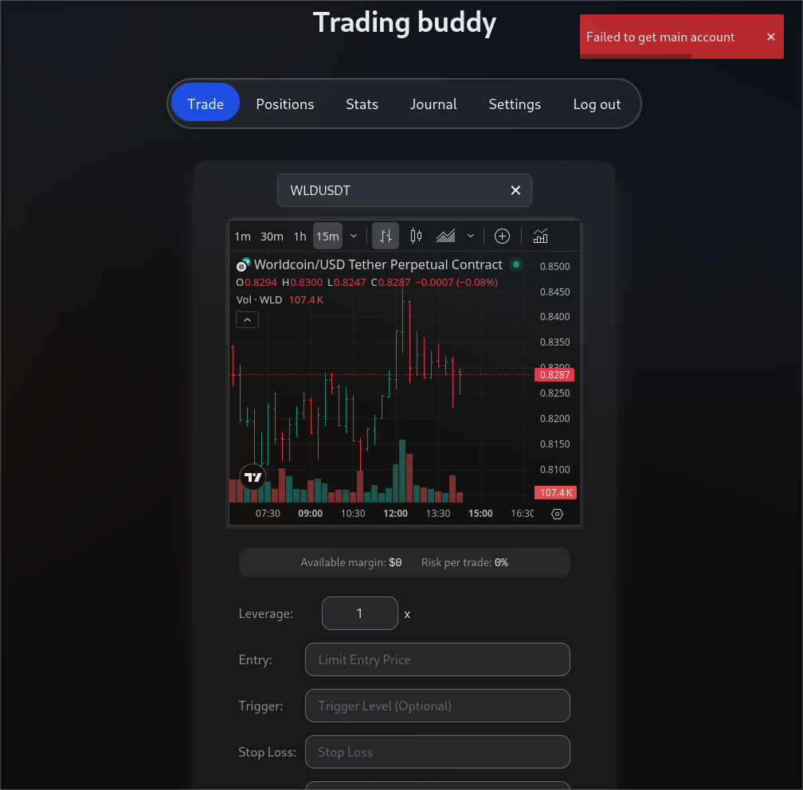
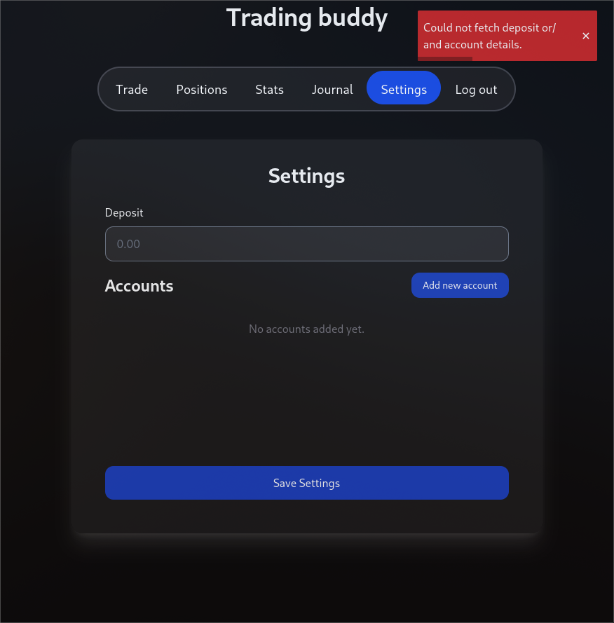
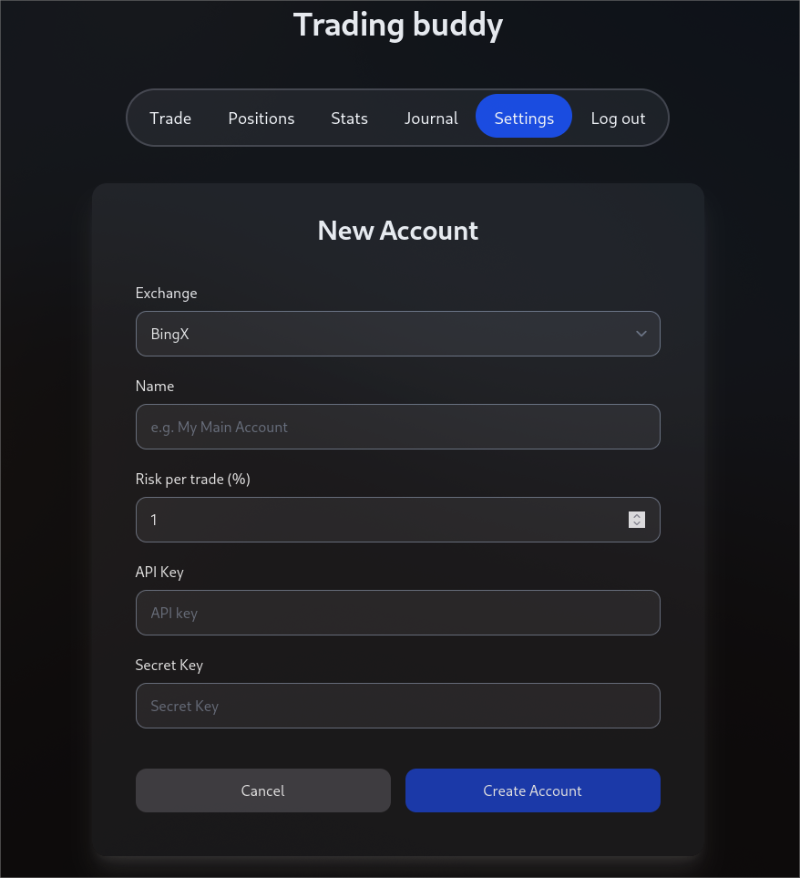
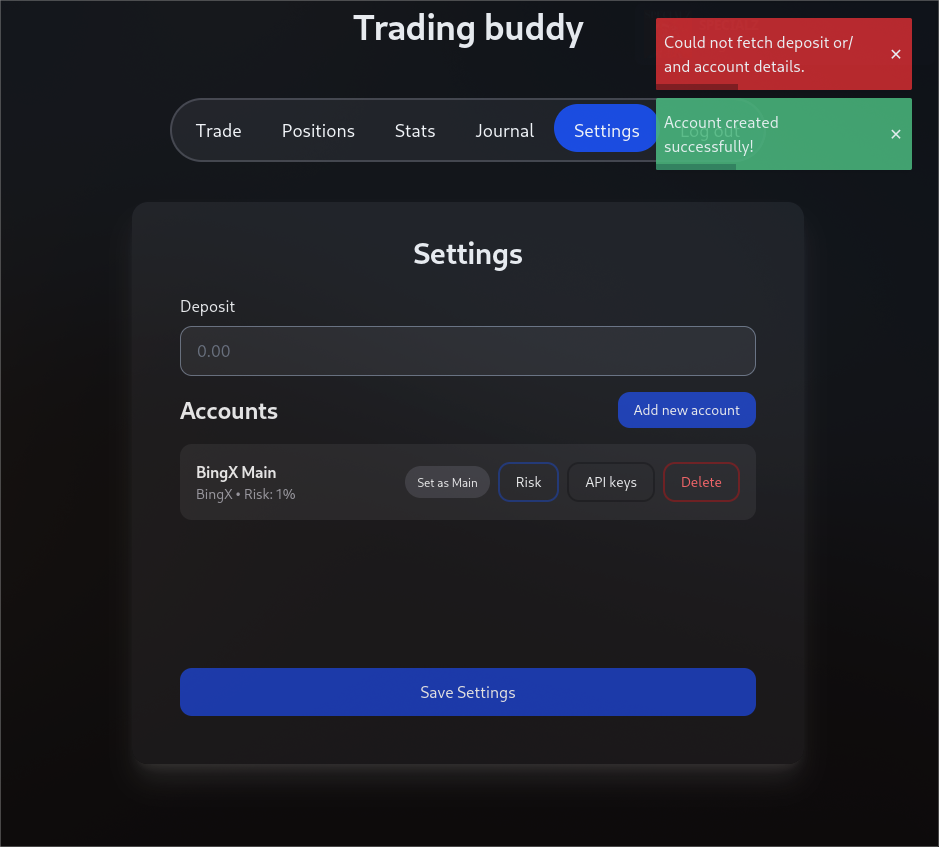
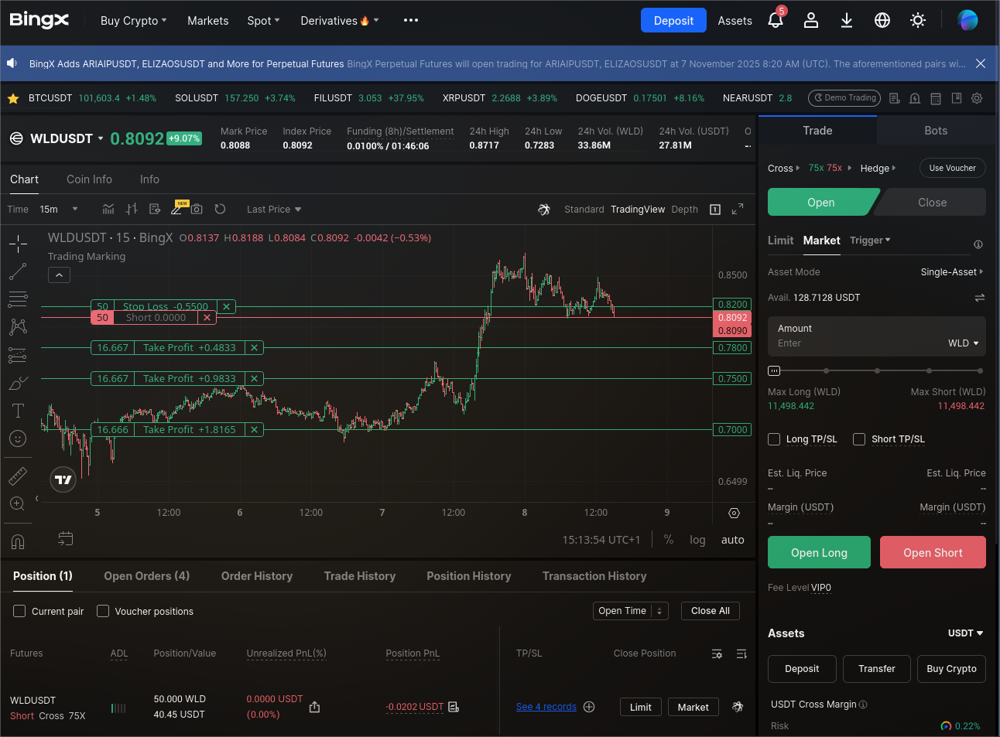
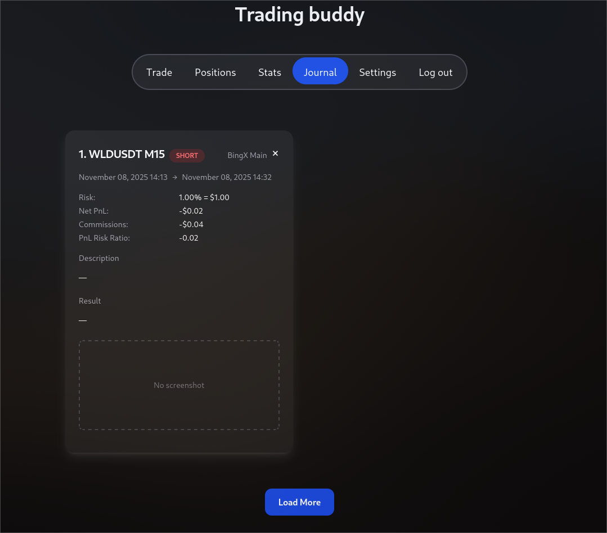
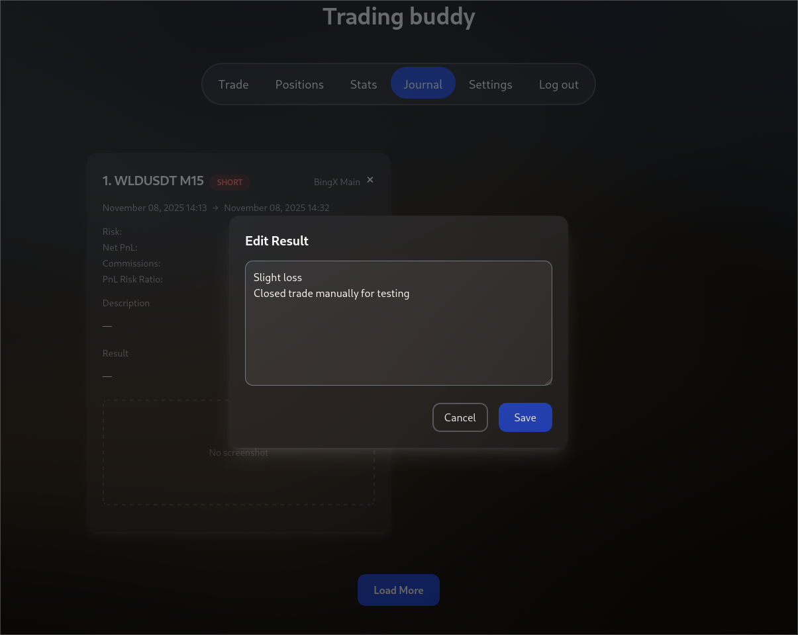

## What is it?
Trading Buddy 2.0 is a web app which serves as an interface between trader and exchange and automates numerous repetitive tasks trader does every trading day. It delivers seamless experience between trader and exchange where trader doesn't have to trade in one place, calculate position size in another one and lead and analyze his trades journal somewhere else.


## What can it do?
Among those automated tasks are:
- Position size calculation based on specified risk and deposit, entry price and stop-loss price
- Specifying more than take-profit before order is placed and filled — Binance, ByBit, BingX allow for specification of only one take-profit before the position is filled
- Removement of the open order when price has reached certain level - useful when you place limit orders and cancel this order if the price goes to far in direction of your take-profit without otder being filled
- Moving stop-loss to entry level after certain take-profit is filled - so you don't have to track your position and manually move the stop-loss
- Tracking all your trades in trading Jounal which automatically fills a bunch of data about your trade for you

Besides features above webapp also has statistics module which shows your trading statistics in clear and useful way.


## How to use it?
### Settings
Visiting trading buddy for the first time, it will greet you with the Sign In screen like below:

Click on Sign up button below, enter credentials and you will be automatically logged in and redirect to **Trade** panel.
You will immediately see a red toast like below:

It pops up because trading buddy tries to fetch leverage limits for selected coin and fails because you haven't yet configured any trading accounts.

Each user can have as many trading accounts as he wants — trading account is not the same as user account, you'll understand this in a bit.

To create your first trading account head to **Settings** panel

Again you'll see an error toast meaning that you don't have any trading accounts at the moment, ignore it for now:

Click on **Add new account**

At the moment only **BingX** exchange is supported

Specify name of your account, risk per trade and next API keys, for BingX you will need first to create an account on the exchange site, and possibly go through KYC and then get the keys [here](https://bingx.com/en/accounts/api). Paste keys into respective fields and hit **Create Account** button, trading buddy will check if keys are valid and in that keys create account for you. 

After this you will be redirected back to settings panel like below:

Mark your newly created account as main by clicking **Set as Main**, meaning it will be used for all your trading until you choose another account as main one.

Update your deposit value to 100 usdt:

Now you are ready to trade!

### Trade
Head to **Trade** panel and let's test trading buddy by opening a limit order on WLDUSDT with 3 partial takes.

By default all entry orders that trading buddy places are limit ones, take profits and stop losses are market orders. And you can't really change this behaviour without changing the source code, but I guess if you worry about slippage you never open your positions by market orders — this is true for me so I don't even need option to open positions by market orders.

Fill entry level, stop-loss and take profits for your next position and see how volume, required margin, potential loss and profit and risk reward ratios are calculated automatically for you!

Also notice that trading buddy automatically knows when you want to open short or long by comparing your stop-loss price to open price.

Hit the **Open Short** button and you will be automatically redirected to **Positions** panel.

### Positions
In our case the position was filled instantly so we'll immediately see it in **Current** section:

Let's head to the exchange site to see if everything was done correctly:

And yes! The position indeed is opened, all partial take-profits are placed for us as well as the stop-loss.

Quick note: for safety reasons orders for position opening always go to the exchange with specified stop-loss and a full take profit on the level of your first take-profit or the only one take-profit you specified. That is done to ensure that you won't ever find yourself in a trade without stop-loss or take-profit - to protect your money.

Let's speed up things and close our position by market order manually by hitting **Close** button on the position widget.


**WARNING**: Close positions only through trading buddy, positions closed from exchange site side won't be properly tracked and finished in tradiong buddy in current version :(.

### Journal
Heading to the **Journal** section we are going to see that our trade was tracked and its data was saved:

**Note**: It may take some time for the app to update trade's data and properly finish it, because trading buddy relies on API that sometimes doesn't update data for finished orders instantly.

Trading Buddy filled a lot of useful information for as out-of-the-box, like:
- Trade direction
- Risk data
- Net PnL
- Commissions
- Actual risk reward ratio of the trade
- Start and end time

So after the trade is finished you don't have to manually type that information into the Journal, the only things that are for you to fill up are:
- Timeframe
- Description of the trade, for example: "Retest of accumulation upper bound, POC is in the low part of the range" 
- Result - field created for you to reflect on the trade and include result for it
- Screenshot - so you can always come back to your journal to get priceless insides about your trading

Fill up respective fiedls just by clicking on them, like for the "Result":



### Stats
Now let's see what we have in tne **Stats** section:


And that's pretty much it.

I hope my tutorial was clear and you will consider using my app, now let's get to some technicals.

## Technicals
Source code is available here --> [source](https://github.com/avtorgenii/trading-buddy-2.0)

### Intro
Trading Buddy 2.0 is actually based on its [legacy version written in FastAPI](https://github.com/avtorgenii/Trading-Buddy).

Version 2.0 aimed to fix huge amount of problems first version had due to tight deadline of the project, which was made for "Scripting languages" course at my uni, and my complete lack of experience working with web frameworks and databases and building somewhat "big" projects at all. Legacy version had poor system design, instead of modern JS frameworks I relied on pure spaghetti JS code written by ChatGPT, order management system was complete mess, instead of separated database I utilized SQLite embedded directly into the backend, so whenever I needed to update code for the backend I had to SCP my ```db.sqlite3 ``` to my machine so whole journal wouldn't be eliminated with the container. And many more problems...

When I say that version 2.0 is based on legacy one I actually mean that only code for integration with the exchange and my custom modified package bingX* are from the legacy version.

*author of this package is actually [niewiemczego](https://github.com/niewiemczego), I tweaked and fixed bunch of stuff in his package so that's why it lies in my repo along with other code.

This version of trading buddy was actually started as group project for "Web programming" course at uni with my colaborator [Tomasz](https://github.com/Tomek4861) as frontend developer. After the project was graded I took his role and continued developing whole project on my own.

### Tech stack
Second version of Trading Buddy uses:
- Django Rest Framework as its backend
- SvelteKit as its frontend even thought SvelteKit is actually a full-stack framework
- Postgres as database
- Offen [docker-volume-backup](https://github.com/offen/docker-volume-backup) for easy backups of the database and media files* to dropbox
- NginX as reverse proxy for easy communication between backend and frontend, almost without CORS pain

*For my personal usage hosting the project on VPS is completely sufficient so I don't use any external serivices like Azure Blob storage and etc. for storing any kind of data — all data except for screenshots for trades is stored in the database, screenshots are stored in a separate docker volume that is plugged to ```media``` dir of the django backend.

Later I will still overengineer infrastructure for trading buddy for my DevOps practice — cloud, k8s and stuff will come into play.

### How everything works?
# TODO 
Draw schema


### Problems
Among problems I am planning to address are:
- Coupled background process for OrderPoller and backend


### Future
In future I am planning to:
- Implement proper CI/CD pipeline
- Separate OrderPoller from the backend, read more about it in my <a href="/blog/2025-11-17-critical-bug-fix-in-order-listener.md">next article</a>
- Refactor frontend
- Add monitoring and central logging hub to the project
- Overengineer infrastructure in couple of ways, now I can think only of deploying to cloud like AWS and building some sophisticated infrastrute for it and deploying to VPS but not with simple docker-compose, rather with Kubernetes and other production level stuff.